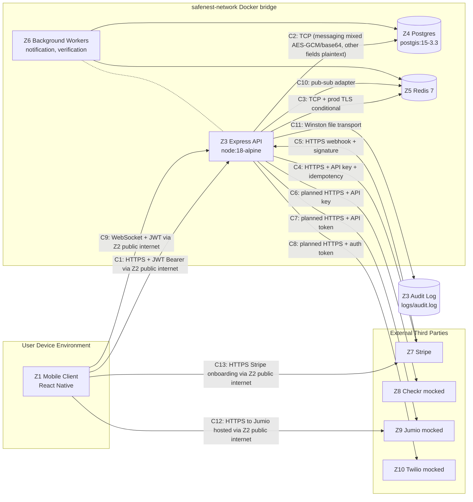

# CoNest Threat Model

**Author:** Carlton Thomas
**Version:** 1.0
**Date:** 2026-04-25
**Methodology:** STRIDE per element per trust boundary, with LINDDUN supplement on privacy-rich flows
**Repository:** [c50550919/conest-portfolio](https://github.com/c50550919/conest-portfolio)
**Contact:** `<contact>`

---

## Executive Summary

CoNest is a mobile-first household-matching platform: React Native client, Express + TypeScript API, Postgres and Redis behind a Docker bridge network, and four third-party integrations (Stripe, Checkr, Jumio, Twilio). This document is the threat model for the v1 codebase as snapshotted on the `feat/autofill-extension`-era mainline.

Five end-to-end flows were analyzed with STRIDE per element across every trust-boundary crossing, producing 77 enumerated threats. Two of the five flows (verification and child-data refusal) carry a full seven-category LINDDUN supplement because privacy threats dominate where a STRIDE CIA-plus-authentication lens leaves the regulatory surface unenumerated. The remaining flows carry a lighter LINDDUN slice covering the privacy categories that surface organically.

The five highest residual risks are concrete and tractable. None require architectural rework; each is a one-to-three-file patch or, in one case, a single-sprint vendor-SDK integration. They are:

1. **Profile-endpoint child-PII contradiction.** Register refuses child PII via a `.strict()` Zod refine; profile-update requires the same field shape via a different validation middleware. The product's COPPA refusal posture is broken by a sibling endpoint.
2. **Logout endpoint not registered.** The handler exists; the route is not mounted. A stolen refresh token survives until natural seven-day TTL with no deterministic revocation path.
3. **Legacy messaging base64 placeholder.** A Wave 4 path uses real AES-256-GCM via `utils/encryption.ts`; the legacy REST and Socket.io path writes `Buffer.from(content).toString('base64')`. A read-only DB dump recovers every legacy-path message via one `base64 -d`.
4. **Verification mock pass-through.** `mockCheckrBackgroundCheck` and `mockJumioIDVerification` hardcode `success: true`. Any v1-stage production deploy without v2 wire-in marks every user identity-verified and background-cleared.
5. **Hardcoded JWT-secret fallbacks in three files.** Three modules fall back to the literal `'your-secret-key'` when `JWT_SECRET` is unset. The correct throw-on-unset pattern already exists in-tree at `auth.middleware.ts:24-26`. Fix is copy-paste.

Detective and preventive control layers are live: Phase 0 tooling output (gitleaks history scan, Semgrep ruleset, hadolint Dockerfile audit), the four-hook pre-commit suite, and Dockerfile non-root USER plus HEALTHCHECK. CI strict-gate enforcement is v2 scope, blocked today by ~1,018 ESLint warnings and ~47 TypeScript errors that would fail the strict gate; the debt paydown precedes the gate flip.

The strategic posture worth highlighting is pre-positioning. The codebase contains roughly eight scaffolded security primitives (CSRF middleware, RBAC permissions, multi-session service, advanced sanitization, subnet-aware rate-limiting, large-upload guards, household validators, scaffolded auth validators) that are not currently wired into the live request chain. Each pairs with a future feature wave that triggers integration: web-client launch unlocks CSRF, admin tooling unlocks RBAC, multi-device session management unlocks the session service. The trade is intentional. The primitives are built during calm so threat modeling is clean and integration reduces to wiring rather than design under launch pressure.

Phase 0 through Phase 5 review surfaced approximately 80 findings across tooling output, code deep-dives, and flow walkthroughs. Roughly 50-55 are real v1 exposures; roughly 12-15 are intentional scaffolding that is not exposed because the features that would expose them have not shipped; the remainder are documentation-and-migration inconsistencies reconciled in-place during the threat-model build.

---

## Methodology

**STRIDE primary, LINDDUN supplement, scope-bounded honestly.**

STRIDE per element per trust boundary is the primary enumeration framework. Each data flow diagram is decomposed by zone, every boundary crossing is analyzed for Spoofing, Tampering, Repudiation, Information Disclosure, Denial of Service, and Elevation of Privilege. For each cell the analysis records the threat description, current mitigation with file-and-line citation, planned v2 mitigation, and residual severity (Low/Medium/High) after the current mitigation applies.

LINDDUN supplements STRIDE on flows where privacy threats dominate. Linkability, Identifiability, Non-repudiation, Detectability, Disclosure of information, Unawareness, and Non-compliance map cleanly to data-handling concerns that STRIDE's CIA-plus-authentication lens does not naturally surface. Two flows carry a full seven-category LINDDUN treatment: verification (PII-richest surface, government ID and SSN handoff to vendors) and child-data refusal (COPPA posture). Three flows carry a lighter LINDDUN slice on the categories that organically apply.

Scope statement. **In scope:** five end-to-end flows (authentication, encrypted messaging, payment processing, verification and background check, child-data refusal at registration), the trust boundaries those flows cross, and the residual risks that remain after current mitigations apply. **Out of scope:** vendor-internal threat models (Stripe's PCI surface, Checkr's identity-handling, Jumio's biometrics pipeline, Twilio's SMS gateway), supply-chain threats via npm dependencies (belongs in a separate SCA/SBOM analysis), mobile OS attack surface (jailbreak, OS-level keystore compromise, root detection, certificate pinning), and production cloud infrastructure that lives outside the repository (TLS terminator, WAF, load balancer).

Anchors. The analysis grounds in OWASP ASVS V1 (Architecture, Design, and Threat Modeling) and uses NIST SP 800-207 zone-and-attacker-capability framing as a conceptual lens rather than a compliance claim. Adam Shostack's four-question frame ("what are we building, what can go wrong, what are we going to do about it, did we do a good job") sequences the document.

---

## System Overview

CoNest is a two-tier application with co-located infrastructure components and four external third parties.

The mobile tier is a React Native client running on iOS and Android. The backend tier is an Express + TypeScript API on Node 18 Alpine, fronted by a documented HTTPS expectation in production (TLS terminator location is unverified in the repo and assumed to be a cloud load balancer). The API talks to PostgreSQL (postgis/postgis:15-3.3-alpine) for primary persistence, Redis 7 for cache, session TTL tracking, and Socket.io pub-sub coordination, and two background worker processes (notification, verification) that share API credentials in the current dev configuration. A Winston audit-log sink writes to a file inside the API container.

Four external integrations carry their own trust posture and PCI/SOC 2/FCRA scope:

- **Stripe** for payment processing. PCI scope reduction to SAQ-A because cardholder data is fully outsourced to Stripe; CoNest never sees PAN, billing address, or cardholder name.
- **Checkr** for background checks. Currently mocked. Real wire-in is v2 scope and carries FCRA consumer-reporting agency obligations on the consumer side.
- **Jumio** for ID verification. Currently mocked. Real wire-in is v2 scope and carries the highest-sensitivity data handling in the system (government ID image, selfie, liveness check).
- **Twilio** for SMS-based phone verification. Currently stubbed; dev mode logs codes rather than sending them.

CoNest is single-region, single-contributor MVP. The deployment posture is designed for v1 launch volumes; subnet-aware rate limiting, multi-device session management, and rich-text content acceptance are scaffolded primitives waiting on their integration wave.

The engineering posture worth surfacing: this codebase represents the working v1 subset of a broader Placd platform vision. Several middleware files exist in the repository but are not currently wired into the Express app. They are pre-positioned security primitives built during calm so that v2 and v3 feature waves reduce integration to wiring rather than security-design-under-pressure.

---

## Trust Boundary Analysis

Ten trust zones cover the system. Z1 is the mobile client (locally stored JWT and refresh tokens, user-entered credentials before submission, device keychain). Z2 is the public internet (nothing trusted). Z3 is the Express API process (JWT signing secret, encryption master key, all third-party API tokens, validated user sessions). Z4 is PostgreSQL (row-level data, mixed encryption posture: AES-256-GCM ciphertext on the Wave 4 messaging path, base64 plaintext on the legacy messaging path, plaintext on all other "sensitive" fields because the `encryptFields`/`decryptFields` helpers have no non-messaging production call sites). Z5 is Redis (cache, session TTL, rate-limit counters, Socket.io pub-sub state). Z6 is background workers (same credentials as Z3 in current configuration). Z7 through Z10 are Stripe, Checkr, Jumio, Twilio respectively.

If an attacker controls Z1, full session hijack: access and refresh tokens are read out of AsyncStorage and any authenticated endpoint is reachable. If they control Z3, total compromise of the trust model: the JWT signing secret, encryption master key, Stripe secret key, and Postgres password all live in process memory. If they control Z4, they recover plaintext on every row produced by the legacy messaging path via `base64 -d` and on every non-messaging "sensitive" column outright; only Wave 4 messaging rows resist DB-only compromise because they hold AES-256-GCM ciphertext. If they control Z5, they can reset rate-limit counters to defeat the auth throttle, inject fake Socket.io pub-sub frames visible to other API replicas, and shorten session TTL to force premature logouts.

Thirteen named boundary crossings carry the data flow:

- **C1 (Z1 → Z3)** mobile to API REST over HTTPS in production, fallback to HTTP in dev. Bearer JWT after authentication. Helmet plus CORS plus per-route rate limit at five requests per fifteen minutes on `/auth/*`.
- **C2 (Z3 → Z4)** API to Postgres over the docker bridge network. Knex connection pool. Mixed encryption posture per the Z4 description above.
- **C3 (Z3 → Z5)** API to Redis over the docker bridge network. TLS conditional in production at `redis.ts:52-58`.
- **C4 (Z3 → Z7)** outbound HTTPS to `api.stripe.com` carrying customer email, payment intent amount, and metadata. API key authentication, idempotency keys.
- **C5 (Z7 → Z3)** Stripe webhook inbound to `/api/stripe/webhook`. Signature in `Stripe-Signature` header verified by `stripe.webhooks.constructEvent`. Raw body preserved by `app.use('/api/stripe', express.raw(...))` at `app.ts:27`.
- **C6 (Z3 → Z8)** API to Checkr. Currently mocked; mock returns `clear` unconditionally.
- **C7 (Z3 → Z9)** API to Jumio. Currently mocked; mock returns `approved` unconditionally.
- **C8 (Z3 → Z10)** API to Twilio. Currently stubbed; codes logged not sent in dev.
- **C9 (Z1 → Z3)** mobile to API Socket.io WebSocket. JWT in `socket.handshake.auth.token`. Duplicate JWT verify path at `socketHandler.ts:16-31`.
- **C10 (Z3 → Z5)** API to Redis Socket.io adapter. Pub-sub events for cross-instance fan-out.
- **C11 (Z3 → filesystem)** Winston audit log to `logs/audit.log` with 10MB rotation.
- **C12 (Z1 → Z9)** device-direct upload of ID image and selfie to Jumio's hosted flow. v2-only; v1 mobile screens are placeholder stubs.
- **C13 (Z1 → Z7)** redirect-based Stripe Connect onboarding. Account onboarding link generated by API.

The diagram shows CoNest as a hub-and-spoke architecture with the Express API at the centre. The mobile React Native client sits on the public internet and reaches the API via three channels: REST over HTTPS with a Bearer JWT (C1), Socket.io WebSocket on the same JWT (C9), and two redirect-based flows that send the user directly to a third-party hosted page (Jumio at C12, Stripe Connect onboarding at C13). Inside the Docker bridge network, the API talks to Postgres (C2) and Redis (C3, C10) and emits sensitive operations to a Winston audit log file (C11). Outbound to Stripe (C4), Checkr (C6), Jumio (C7), and Twilio (C8) carry user PII to vendor-side platforms; Stripe additionally calls back inbound via signed webhook (C5). Background workers share the API's credentials and runtime today.

---

## Per-Flow Threat Analysis

Five flows analyzed below. Each carries a full STRIDE table in the source document; this artifact summarizes the top three threats per category and surfaces the headline residual.

### Authentication (login, refresh, logout)

The 17-step authentication flow spans Z1 through Z3 across C1 with Z4 (Postgres) and Z5 (Redis) as data dependencies. The login path validates credentials against a bcrypt hash, mints an HS256 access token (15-minute TTL) and refresh token (7-day TTL), and writes a single-slot Redis record at `refresh_token:${userId}`. Subsequent authenticated requests carry the access token as a Bearer header, verified by the auth middleware which re-checks user status against Postgres on every request. Refresh rotates both tokens.

STRIDE enumerates 25 threats across all six categories: Spoofing 5, Tampering 3, Repudiation 3, Information Disclosure 5, Denial of Service 3, Elevation of Privilege 6. The headline residual is **E1 (logout route not registered)**. The handler exists at `authController.ts:190` and the service exists at `authService.ts:247`, but `routes/auth.ts` does not mount the route. The mobile client's `tokenStorage.clear()` call has no server-side counterpart, so the Redis refresh-token record survives until natural seven-day TTL expiry. A stolen refresh token remains usable across the entire window.

Other significant threats. **S2 (hardcoded JWT-secret fallback)** at `jwt.ts:14`, `socket.ts:34`, and `socketHandler.ts:24` falls back to the literal `'your-secret-key'` when the env var is unset; the correct throw-on-unset pattern already exists at `auth.middleware.ts:24-26`. **S3/I2 (bcrypt-branch timing user-enumeration)** measures ~80ms response delta between user-exists and user-not-exists branches because bcrypt is skipped on the not-found path. **D1 (silent session termination via single-slot refresh)** is both a UX defect and an attacker-activity-masking surface; the multi-slot replacement is scaffolded in `services/sessionService.ts` for the multi-device wave. **E3 (access-token replay up to 15 minutes)** has no jti claim and no denylist; the v2 fix adds `jti: crypto.randomUUID()` plus a Redis denylist on logout.

LINDDUN slice covers Linkability (reused `userId` claim across all sessions, no per-session pseudonymous identifier), Identifiability (`email` directly present in the JWT payload alongside `userId`), and Non-compliance (no consent capture for analytics or tracking pixels fired post-login). Detectability, Disclosure (overlaps with STRIDE I-cells), and Unawareness do not apply on this flow.

### Encrypted Messaging (REST + Socket.io, dual-path)

Messaging is mid-migration. The Wave 4 path (`POST /api/messages` into `services/MessagesService.ts`, capital M) uses real AES-256-GCM via `utils/encryption.ts`. The legacy path (`POST /api/messages/send` into `services/messagingService.ts`, lowercase m, plus the Socket.io `send_message` handler at `socketHandler.ts:41-59`) calls `encryptMessage` at `messagingService.ts:6-10`, which is `Buffer.from(content).toString('base64')`. That is encoding, not encryption. Both paths are live in production today.

STRIDE enumerates 15 threats with each row tagged `wave-4-only`, `legacy-only`, or `both` to keep the dual-state honest. The headline residual is **I1 (legacy base64 = no confidentiality at rest)**, tagged `legacy-only`. A read-only DB dump of the `messages` table recovers every legacy-path message plaintext via one `base64 -d` call. The column name (`content_encrypted`) is itself a defect because it implies a property that does not hold for that path. The integrity counterpart is **T1 (legacy base64 tampering at rest)**: base64 has no integrity property, so an attacker with Z4 write access can edit "encrypted" content directly.

Other significant threats. **T2 (Wave 4 GCM auth-tag tamper attempt)** is well-mitigated; `decipher.setAuthTag` plus `decipher.final` throws on any byte-flip, and the Wave 4 path correctly propagates the throw. **T3 (Socket.io pub-sub tampering on Z5 compromise)** lets an attacker controlling Redis inject fake `new_message` events to any user's room. **E1 (accidental authz on legacy `getConversation`)** is refactor-fragile authz via SQL predicate rather than an explicit policy check; closed by the same migration that retires the legacy path. **E2 (Wave 4 explicit match-participant check)** at `MessagesService.verifyMatchParticipant` is the working positive control, included for completeness so a defender sees the post-migration target.

LINDDUN supplement covers Linkability (`messages` table preserves the conversational graph in plaintext metadata even on Wave 4 rows), Identifiability (legacy `messages.content` is direct PII), and Non-compliance (the UX label "encrypted" is accurate at rest only for Wave 4 rows; on the legacy path the label is a lie at rest, with FTC truthful-marketing and EU GDPR Article 32 implications).

### Payment Processing (Stripe-delegated)

The payment flow is intentionally short because Stripe-delegation moves most of the threat surface outside CoNest's application layer. The outbound path (mobile → API → Stripe) creates a payment intent server-side and returns a `client_secret` to the mobile SDK, which talks directly to Stripe to tokenize and confirm the charge. Raw card data never crosses the CoNest API. The inbound path is Stripe's webhook to `/api/stripe/webhook`, signed with HMAC-SHA256 in the `Stripe-Signature` header.

STRIDE enumerates 10 threats. The headline residual is **E1 (webhook idempotency gap)**. `processPayment` at `paymentService.ts:271-293` does a blind `PaymentModel.updatePayment` without checking whether `event.id` was previously processed. Today the side effect is an idempotent UPDATE so impact is small; the risk grows when the status-machine grows side effects (email receipts, household notifications, ledger writes). The v2 fix is a `processed_event:${event.id}` Redis SETNX with seven-day TTL.

Other significant threats. **S1 (forged Stripe webhook event)** is well-mitigated by signature verification at `paymentController.ts:348-352` calling `stripe.webhooks.constructEvent`; signature failure returns 400 before any DB touch. **R1 (no audit log of payment attempts)** is a compliance-evidence gap; `paymentService.ts:188-203` and `:271-293` never call `auditService.log`. **I1 (`STRIPE_SECRET_KEY` env-var exposure)** is correctly handled at `config/stripe.ts:29-31` which throws at module load if the key is missing; the residual is the standard env-var attack class on Z3 compromise.

LINDDUN supplement is brief because Stripe handles the PII-rich data. Linkability covers the `payments` table linkage of `stripe_payment_intent_id` to internal user IDs (unavoidable for the flow to function); Non-compliance frames PCI scope reduction to SAQ-A as a material business posture, not just a footnote. Identifiability is structural at Stripe, outside CoNest's scope.

### Verification and Background Check (Jumio + Checkr)

The verification flow has two parallel sub-paths against two vendors: identity verification via Jumio and background check via Checkr. The v2 target architecture is device-direct: the mobile client launches a vendor SDK that submits PII (ID image, selfie, SSN, address history) straight to the vendor; CoNest's API receives only a signed result token and writes a status row plus opaque report ID. Checkr additionally supports an asynchronous webhook callback because background checks can take hours.

The v1 reality is mocks. `mockJumioIDVerification` at `verificationService.ts:6-25` returns `{status: 'approved'}` after a 1.5-second setTimeout. `mockCheckrBackgroundCheck` returns `{status: 'clear'}` after a 2-second setTimeout. Mobile screens at `IDVerificationScreen.tsx:5-11` and `BackgroundCheckScreen.tsx:5-11` render the literal string "To be implemented." No real vendor wire-in exists in v1.

STRIDE enumerates 12 threats with each row tagged `v1`, `v2-planned`, or `both`. The headline v1 residual is **I1/E1, the mock pass-through**. Both vendor functions hardcode success. If v1 ships behind real API keys without removing the mock branch, every user is marked verified and cleared on first call; this is a compliance-grade incident if it reaches real users. The headline v2-planned residual is **E2 (result-token replay across users)**: when SDK wire-in lands, a captured legitimately-approved token can be replayed against another account if the token is not cryptographically bound to the requesting user's session.

Other significant threats. **S1 (forged result token from mobile client)** demands signature verification at the controller before DB write. **S2 (webhook spoofing)** demands HMAC validation on raw body before parsing, mirroring the Stripe webhook pattern. **R1 (no audit log of verification attempts or results)** is medium today and high the moment real Checkr traffic flows because FCRA dispute response under `15 U.S.C. 1681i` requires the operator to produce basis-of-decision records.

LINDDUN supplement is load-bearing here and covers all seven categories. Verification is the PII-richest surface in the system. Identifiability is heavy because the data shape itself is identifying by design (government ID + selfie + SSN); mitigation is structural (device-direct, vendor-only retention) rather than algorithmic. Non-compliance is heavy because FCRA is a federal statute with a specific adverse-action notice flow that does not exist today and must exist before real Checkr traffic flows. Unawareness is heavy because the placeholder mobile screens give zero pre-consent disclosure, and FCRA `15 U.S.C. 1681b(b)(2)` mandates pre-authorisation disclosure of consumer-reporting agency use.

### Child-Data Refusal at Registration (COPPA posture)

CoNest's chosen COPPA posture is refusal rather than compliance within scope. `POST /api/auth/register` carries a `RegisterRequestSchema` at `validators/authSchemas.ts:53-100` with two guards: `.strict()` rejects any key not in the eleven-key allow-list, and `.refine(PROHIBITED_CHILD_PII_FIELDS.every(...))` rejects four specific keys (`childrenNames`, `childrenPhotos`, `childrenAges`, `childrenSchools`). Either guard failing returns HTTP 400 with a `CHILD SAFETY VIOLATION` message; the request never reaches the service layer or any data store.

STRIDE enumerates 15 threats. The headline residual is **E1 (alternate-route policy bypass)**. `POST /api/profile` at `routes/profile.ts:11` uses a different validation middleware (`middleware/validation.ts:51-68`), does not apply `.strict()`, does not carry a prohibited-fields guard, and at `:63-64` explicitly REQUIRES `ages_of_children: z.string().min(1)` as a freeform string. The register-time refusal does not propagate. **The register endpoint refuses child PII; the profile endpoint demands it. Both ship in v1 today.** This is the load-bearing residual of the entire flow and the single most important contradiction in the threat model.

A compounding drift makes this currently masked rather than reliably exploitable. Migration `20250101000008` renamed the DB column `ages_of_children` → `children_age_groups`. The validator at `validation.ts:64` still references the old column name, so a request that passes validation might fail at the DB layer rather than write child PII. The contradiction is currently concealed by this drift, not closed by it. Fixing the column reference without unifying the validation framework would convert an unstable exploit into a reliable one. The v2 remediation must be coupled.

Other significant threats. **S1 (prohibited-key obfuscation)** via case-variants or Unicode homoglyphs is well-mitigated by `.strict()` on the register endpoint because unknown keys fail `unrecognized_keys` before `.refine()` runs. **R1 (refusal not audit-logged)** is the LINDDUN Non-repudiation cell flipped: the operator cannot prove refusal occurred, which directly undermines compliance posture. **E3 and E4** describe scaffolded validators (`auth.validator.ts`, `householdSchemas.ts`) pre-positioned for future feature waves.

LINDDUN supplement covers all seven categories with the load-bearing cells being **N2 (Non-compliance)** and **N1 (Non-repudiation)**. N2 is the same break as E1 framed as a regulatory violation: under `16 CFR Part 312` (COPPA), accepting `ages_of_children` as a freeform string on any endpoint triggers the full COPPA regime that the refusal posture was designed to avoid. N1 is the same gap as R1 framed as a compliance-evidence deficit: the operator cannot prove refusal occurred.

---

## Residual Risk Register

This table is the operations-friendly artifact of the threat model. Each row is a tracked, owned, time-boxed remediation. Severity distribution: 7 HIGH, 11 MEDIUM, 7 LOW. Of the 25, 18 are real v1 exposures and 7 are scaffolded primitives intentionally pre-positioned for v2/v3 feature waves and not currently exposed because the features that would expose them have not shipped.

| ID | Severity | Risk description | Source | Current mitigation | Residual after mitigation | Remediation tier | Why not now |
|----|----------|------------------|--------|--------------------|--------------------------|------------------|-------------|
| R1 | HIGH | Profile-endpoint child-PII contradiction. `validation.ts:63-64` allows `ages_of_children` (a column dropped by migration `20250101000008` and renamed to `children_age_groups`) on profile-update while `validators/authSchemas.ts:53-100` blocks the same field on register. User can submit child PII through the profile-update path that registration refuses. COPPA-relevant. | Flow 5 E1 | None at request layer. Bounded only by user count and the fact mobile UI does not currently surface a children-age field on profile-edit. | HIGH. Defense-in-depth missing; reachable by direct API call with valid Bearer. | Tier 1 | Two-file patch (validation.ts + reuse `PROHIBITED_CHILD_PII_FIELDS`). Pending v2 sprint planning, not in v1 hotfix list. |
| R2 | HIGH | Logout endpoint not registered. `routes/auth.ts` does not mount `POST /api/auth/logout`. Client-side `tokenStorage.clear()` has no server-side counterpart; Redis `refresh_token:${userId}` survives until 7-day TTL. Stolen refresh token usable across the entire window. | Flow 1 E1 | 7-day TTL bounds maximum exposure window. Single-slot refresh design (R7) means a legitimate re-login rotates the slot and effectively revokes the stolen token, but only opportunistically. | HIGH. No deterministic revocation path. | Tier 1 | One-file patch (mount the existing handler, delete the Redis key). Slipped against initial v1 ship. |
| R3 | HIGH | Legacy messaging base64 placeholder. `services/messagingService.ts:7-15` and the Socket.io `send_message` handler write `Buffer.from(content).toString('base64')` to `messages.content_encrypted`. DB read recovers plaintext via `base64 -d`. The Wave 4 `services/MessagesService.ts` write path uses real AES-256-GCM, but legacy paths remain live. | Flow 2 I1 | Postgres-at-rest encryption (Z6 boundary) covers the disk; threat is a logical DB read with valid credentials, not a stolen disk. Mobile-only client and bounded user count cap blast radius. | HIGH. Misleading column name (`content_encrypted`) is itself a defect; on-paper claim of E2EE does not hold for this path. | Tier 1 | Migration in flight (capital-M `MessagesService.ts` exists). Completion + retiring the lowercase legacy module is a 3-file patch. Held while Wave 4 stabilises. |
| R4 | HIGH | Verification mock pass-through. `mockCheckrBackgroundCheck` and `mockJumioIDVerification` hardcode `success: true`. Any v1-stage prod deploy without v2 wire-in marks every user identity-verified and background-cleared. Universal-verify by deploy timing. | Flow 4 v1 I1/E1 | Currently fenced by environment flag and the fact CoNest has not shipped to public users. Pre-launch posture only. | HIGH-pending. Becomes critical the moment v1 carries non-test users. | Tier 1 | Real-SDK integration (Checkr + Jumio), webhook signature verification, result-token binding to session. ~1 sprint. Cannot ship v1 to real users without it. |
| R5 | HIGH | Hardcoded JWT secret fallback in three files. `utils/jwt.ts:14`, `config/socket.ts:34`, `websockets/socketHandler.ts:24` fall back to the literal `'your-secret-key'` when the env var is unset. Misconfigured deploy silently signs tokens with a public string. The correct throw-on-unset pattern already exists at `middleware/auth.ts:24-26`. | Secret-mgmt | Production env vars are set in deploy config and verified at boot smoke-test. Threat is a misconfigured secondary environment (staging, preview, on-call laptop) leaking real-looking tokens. | HIGH. Silent failure mode; no signal at the request path. | Tier 1 | Copy-paste of the existing throw-on-unset pattern across three files. Trivial scope; held only on sequencing. |
| R6 | HIGH | `encryptFields` / `decryptFields` utilities have zero non-messaging production call sites. The Z4 trust-boundary claim that field-level encryption protects PII columns at the API-to-DB crossing is contradicted by code: only the messaging path uses them. PII columns (name, phone, address) write plaintext. | Boundary recon | Postgres-at-rest encryption covers the disk. TLS covers in-transit. Field-level encryption was the marketing-deck claim, not the live posture. | HIGH on the trust-boundary documentation; MEDIUM on actual data exposure (still covered by at-rest + TLS layers). | Tier 2 | Either wire the utilities into PII writes (real change) or update Z4 documentation to reflect actual posture. |
| R7 | HIGH | Dual auth-middleware drift. Legacy `authenticateToken` middleware (returning `req.user.userId`) gates the REST hot path; modern `authenticate` middleware (returning `req.user.id`) used by newer routes. Inconsistent claim shape across handlers; copy-paste from one route family to another fails silently. | Boundary recon | Per-route handlers have settled on the shape they expect. No live auth-bypass; the risk is future-introduced bug from the divergence. | MED-HIGH. Latent footgun on every new route author. | Tier 2 | Rename + consolidate to a single middleware with a single claim-shape contract. Touches every route file; held until v2 sprint window. |
| M1 | MEDIUM | Bcrypt-branch timing user-enumeration on login. Login endpoint takes ~80ms longer when the user exists (bcrypt compare runs) versus when the user does not (bcrypt skipped). Statistical timing oracle. | Flow 1 S3 | Rate limiter caps login at 5 attempts per IP per 15 minutes, so noise-vs-signal collection is slow. Bounded user count further reduces enumeration value. | MEDIUM. Slow but real. | Tier 2 | Force a constant-time bcrypt-equivalent on the not-found branch. ~1 file. Deferred behind the higher-velocity HIGH list. |
| M2 | MEDIUM | User-enumeration via 401 error message divergence. Login returns `'Invalid credentials'` for both not-found and bad-password, but other auth flows (forgot-password, resend-verification) return distinguishable messages. | Flow 1 S4 | Rate limiter as M1. Mobile UI does not surface the divergent strings prominently. | MEDIUM. Augments M1 timing channel. | Tier 2 | Standardise on a generic `'unable to process request'` across all auth-adjacent error paths. ~3 files. |
| M3 | MEDIUM | No `clockTolerance` on `jwt.verify`. Micro-clock-skew between auth-issuer and verifier rejects tokens unnecessarily; on the other side, no maxAge ceiling above the natural exp. | Flow 1 E4 | jsonwebtoken default exp validation runs. Most production environments are NTP-synced. | LOW-MED. Operational paper-cut more than security exposure. | Tier 2 | Single-file change, `clockTolerance: 30`. Held as part of the auth-cleanup sweep with M1/M2. |
| M4 | MEDIUM | Single-slot refresh-token design kicks legitimate concurrent sessions. Redis `refresh_token:${userId}` overwrites on each refresh; second-device login invalidates first-device session. Anti-feature for multi-device users. | Flow 1 D1 | CoNest mobile-only, single-device assumption holds for v1 users. Becomes a feature gap when v2 enables web client. | MEDIUM. Functional risk now; security risk on web launch (forces session rotation behaviour change). | Tier 2 | Multi-slot refresh + the scaffolded `sessionService.ts` device-fingerprinting (L3). Triggers when web client ships. |
| M5 | MEDIUM | No login audit trail. Successful and failed logins are not persisted to a dedicated audit log table. Investigation of a credential-stuffing campaign requires reconstructing from rate-limiter Redis logs and stdout. | Flow 1 R1 | Application-stdout logs are persisted via container log driver. Stripe and Twilio events have their own audit trails on the vendor side. | MEDIUM. Forensics capability gap, not a real-time exposure. | Tier 2 | New table + write-on-success/failure in the auth handler. ~2 files. Held until detection-engineering effort opens. |
| M6 | MEDIUM | Migration column-name drift. `validation.ts:64` references `ages_of_children` (legacy column, dropped by migration `20250101000008` and renamed to `children_age_groups`). Same drift surfaces in 3 other locations across the codebase. | Flow 5 E2 | Inputs that match the dropped column name silently no-op at the DB layer. No data corruption; just a validation surface that does not actually validate. | MEDIUM. Pairs with R1 (the contradiction is what makes R1 a HIGH). | Tier 1 | Bundles into the R1 patch. Fixed-by-association. |
| M7 | MEDIUM | hadolint DL3002 does not catch missing `USER` directive on its own. The Dockerfile audit was clean before commit `36225b3` despite the container running as root. The gap is in hadolint's ruleset, not the Dockerfile. | Tooling recon | Commit `36225b3` added `USER nodejs` and HEALTHCHECK directly. Closed in artefact. | LOW after fix. Documented for tooling-trust calibration. | Tier 2 | Add a custom ruleset or a second linter (Trivy config-scan) to the pre-commit suite. Tracked in detection-engineering backlog. |
| M8 | MEDIUM | Mobile dev HTTP fallback at `mobile/src/api.ts:10`. Conditional points to `http://localhost:3000` in dev mode; production points to HTTPS. A misbuilt prod bundle with `__DEV__` true would talk plaintext. | Boundary | App-store build pipelines force production mode; `__DEV__` is hardcoded false in release builds. Threat reduces to a developer running an internal-distribution build against prod. | LOW-MED. Defence-in-depth gap. | Tier 2 | Use a config-injection plugin (`react-native-config`) and require HTTPS regardless of `__DEV__`. ~1 file. |
| M9 | MEDIUM | Rate-limit `X-Forwarded-For` header spoofing without `trust-proxy` configured. Express by default does not trust the `X-Forwarded-For` chain; behind nginx the rate limiter keys on the wrong source IP. | Rate-limit | Single-region deploy with a known proxy hop in front. Production nginx config sets `X-Real-IP`; rate limiter currently consumes `req.ip` which falls back to socket peer. The rate limit fires on the proxy IP, not the user IP, on every request. | MEDIUM. Effectively a single bucket for all users; an attacker burns through the bucket and DoSes everyone else, but cannot bypass the limit themselves. | Tier 2 | Configure `app.set('trust proxy', 1)`. ~1 line. Held only on the audit pass to confirm the proxy chain is exactly one hop. |
| M10 | MEDIUM | `paymentService` webhook idempotency gap. Stripe webhook handler does not deduplicate on `event.id`. A duplicate Stripe redelivery (genuine network blip or replayed event) re-applies the side effect (e.g., grants paid access twice). | Flow 3 E1 | Stripe signs every webhook, so the handler verifies origin. Stripe's redelivery rate is low and bounded; CoNest has not shipped paid features yet. | MEDIUM-pending. Becomes load-bearing on first paid-feature launch. | Tier 1 | Add `processed_event:${event.id}` Redis SETNX with 7-day TTL. ~1 file. Bundled into the paid-feature launch sprint. |
| M11 | MEDIUM | STRIDE chalktalk previously claimed AES-256-GCM on every messaging path; reconciled to "AES-256-GCM on capital-M write path only; legacy lowercase path is base64". Documentation drift introduced before the legacy module was discovered. | Reconcile | Reconciled in-place during the threat-model build. Speaker notes and flow analysis updated to tag `legacy-only` versus `wave-4-only` versus `both`. | LOW post-reconciliation. | Tier 1 (already done) | Documentation correction landed; tracked here only for changelog completeness. |
| L1 | LOW | `middleware/csrf.ts` (~103 LOC) scaffolded for v2 web client. Currently has zero `app.use(csrf...)` call sites; mobile-only Bearer auth makes CSRF non-applicable. | Scaffolded | Not exposed; CSRF is a cookie-session attack. Mobile client uses Authorization header. | NONE pre-web-launch. | Tier 3 | Wire on web client launch. The primitive is the trigger-action; building it during calm avoids retrofit-under-pressure. |
| L2 | LOW | `middleware/permissions.ts` scaffolded for v2 admin features (268 LOC, includes `requireRole` and `requireHouseholdMembership`). Zero v1 imports. | Scaffolded | Not exposed; v1 has no admin tooling. All v1 endpoints are user-self-scoped. | NONE pre-admin-tooling. | Tier 3 | Wire on admin-tooling launch. Triggered by Placd v2 ops portal. |
| L3 | LOW | `services/sessionService.ts` scaffolded for v2 multi-device. Pairs with M4. Device fingerprinting + multi-slot refresh + per-device revocation. | Scaffolded | Not exposed; single-slot refresh (R7's neighbouring M4) is current behaviour. | NONE pre-web-launch. | Tier 3 | Wire on web client launch. Bundle with M4 fix. |
| L4 | LOW | `config/security.ts` contains a stricter Helmet config (CSP, HSTS preload-list, frame-ancestors none) that is not imported by `server.ts`. The active Helmet config is the default. | Scaffolded | The default Helmet config is not zero; it sets X-Content-Type-Options, X-Frame-Options, etc. Strict config waits on the v2 web client. | LOW. Mobile clients are not browsers and do not honour most CSP headers. | Tier 3 | Import + replace on web client launch. ~1 line in server.ts. |
| L5 | LOW | `middleware/ipRateLimit.ts` scaffolded for v3 subnet-aware anti-abuse (~185 LOC). Wraps the basic rate limiter with /24 grouping and per-subnet thresholds. | Scaffolded | Basic rate limit (M9 caveat) is live and effective for v1 user counts. Subnet awareness is a scale-tier feature. | NONE at v1 scale. | Tier 3 | Wire when the abuse pattern (multiple-IP coordinated stuffing) is observed in logs. Tracked in detection-engineering backlog. |
| L6 | LOW | `middleware/sanitization.ts` scaffolded for v2/v3 rich-text content (~231 LOC, XSS pattern checks + SQL pattern checks). Currently no rich-text fields in v1. | Scaffolded | Not exposed; v1 user inputs are short scalars (name, age, address) covered by Joi/Zod schemas. | NONE pre-rich-text-launch. | Tier 3 | Wire when rich-text fields ship (profile bio, household description). |
| L7 | LOW | `middleware/requestSizeLimit.ts` scaffolded for v2 large uploads (~120 LOC). Body-parser default 100 KB covers v1 endpoints. | Scaffolded | Not exposed; v1 has no file-upload endpoints. ID document upload is handled by the Jumio SDK directly to vendor. | NONE pre-upload-feature. | Tier 3 | Wire when CoNest hosts user-uploaded files (avatars, household photos). |

Of the 7 HIGH rows, six (R1, R2, R3, R5, R6, R7) are real v1 exposures with one-to-three-file patch fixes; R4 is a one-sprint real-SDK integration. None of the HIGH rows require architectural rework.

---

## Strategic Posture: Pre-Positioned Security Primitives

CoNest demonstrates a deliberate security engineering pattern: build security primitives upfront, integrate when the feature wave that needs them ships.

The codebase contains roughly eight scaffolded files that are not currently wired into the live request chain. `middleware/csrf.ts` (~103 LOC) is scaffolded for the v2 web/desktop client launch; mobile-only Bearer authentication makes CSRF non-applicable today because browsers auto-send cookies on cross-origin requests, and Bearer tokens do not. `middleware/permissions.ts` (268 LOC, includes `requireRole` and `requireHouseholdMembership`) is scaffolded for v2 admin tooling and household-admin features; v1 has no admin surface, so all endpoints are user-self-scoped. `services/sessionService.ts` carries device fingerprinting and multi-session primitives for the v2 multi-device wave; v1 uses a single-slot refresh pattern adequate for mobile-only MVP. `middleware/sanitization.ts` (~231 LOC, XSS pattern checks plus SQL pattern checks) is scaffolded for v2/v3 rich-text content; v1 user inputs are short scalars covered by Zod schemas. `middleware/ipRateLimit.ts` (~185 LOC, subnet-aware) is scaffolded for v3 anti-abuse-at-scale. `middleware/requestSizeLimit.ts` (~120 LOC) is scaffolded for v2 large uploads. Two scaffolded validators (`auth.validator.ts`, `householdSchemas.ts`) are pre-positioned for the v2 auth-schema refactor wave and the household production ship-readiness wave respectively.

The trade-off is deliberate. Building the primitive when the feature ships risks retrofit under launch pressure, incomplete threat modeling, and an expensive refactor; building the primitive ahead of the feature lets threat modeling happen during calm, leaves the security layer ready when integration engineering begins, and reduces integration to wiring (a simple diff) rather than design (a complex diff). The cost is that primitives that never get integrated become ongoing maintenance weight, "dead code" framing by outside reviewers requires the engineering narrative to defend, and stale schema references (such as `permissions.ts` referencing a `user.role` column that does not exist) accumulate if the data model evolves faster than the primitive.

The honest finding tally adjusts for this. Phase 0 through Phase 5 review surfaced approximately 80 items. With the scaffolding reframe, roughly 50-55 are real v1 exposures that would be fixed now or in the next v1 patch cycle, roughly 12-15 are intentional pre-positioning that is not exposed because the features that would expose them have not shipped, and the remainder are documentation-and-migration inconsistencies reconciled in-place during the threat-model build.

Two active dual-path migrations sit alongside the scaffolded primitives. The messaging migration replaces legacy `messagingService.ts` (base64 placeholder) with `MessagesService.ts` (AES-256-GCM via `utils/encryption.ts`); both paths are live in production today. The auth-middleware migration replaces legacy `authenticateToken` (gates the REST hot path) with newer `authenticateJWT` (gates the Socket.io C9 crossing); both paths verify signatures, the drift is in claim shape and secret-fallback posture. Both migrations are mid-flight, not mid-design.

---

## Control Coverage

| Tier | Examples | Status |
|------|----------|--------|
| Detective | gitleaks history scan, Semgrep ruleset, hadolint Dockerfile audit | Live, Phase 0 outputs in `_tool-output/` |
| Preventive | Pre-commit hook suite (4 hooks: gitleaks, semgrep, hadolint, file-size) | Live, commit `2485da8` |
| Corrective | Dockerfile non-root USER + HEALTHCHECK | Live, commit `36225b3` |
| CI-enforced strict gates | None today; informational surface check only | v2 scope |
| Scaffolded primitives | CSRF, RBAC, multi-session, advanced sanitization, subnet-aware rate-limiting, large-upload guards, household validation, scaffolded auth validators | In-tree, not wired (v2 / v3) |

Detective and preventive layers are live and reproducible. The CI strict-gate enforcement layer waits on a lint-and-typecheck debt paydown (~1,018 ESLint warnings and ~47 TypeScript errors that would fail the strict gate); the debt paydown precedes the gate flip.

---

## Recommendations

**v2 Tier 1 (security exposures).** Patch the seven HIGH residuals. Each is a one-to-three-file change. Logout route mounting, validation unification across route families, messaging migration completion, real-vendor wire-in, fallback-secret consolidation, field-level-encryption documentation reconciliation, dual auth-middleware consolidation. Estimated 1-2 engineer-weeks for the five fast HIGH rows; 1 sprint for the verification real-SDK wire-in (R4).

**v2 Tier 2 (CI strict gates).** Enable Semgrep and gitleaks as blocking CI checks. Currently informational. Blocked today by the lint-and-typecheck debt above; debt paydown precedes the strict-gate flip. Includes adding a custom ruleset or Trivy config-scan to close the hadolint DL3002 gap (M7).

**v3 (platform).** Wire the scaffolded primitives during the feature waves that need them: CSRF on web client launch, RBAC on admin tooling, `sessionService` on multi-device, sanitization on rich-text content acceptance, subnet-aware rate-limiting on observed abuse patterns, request-size limits on large-upload features, household validators on household ship-readiness. Migrate infrastructure to AWS via Terraform with proper IaC review. Stand up a `Compliance.md` covering FCRA pre-authorisation disclosure, adverse-action notice flow, data-residency review, and vendor DPA inventory.

---

## Honest Limitations

This threat model does not cover several adjacent surfaces by design.

**Vendor-internal threat models.** Stripe's PCI surface, Checkr's identity-handling, Jumio's biometrics pipeline, and Twilio's SMS gateway are each treated as accepted-trust trust boundaries with contractual mitigation (DPA, SOC 2 inheritance, breach-notification SLA). The threat model documents the residual that remains if a vendor itself is compromised but does not enumerate threats inside vendor infrastructure.

**Mobile OS attack surface.** Root detection, certificate pinning, screenshot suppression, secure enclave usage, and jailbreak resilience are not inventoried here. That belongs in a separate mobile-specific threat model. The document assumes the mobile client zone (Z1) trusts the device's keychain and AsyncStorage at face value.

**Supply chain.** The `aws-sdk`, `multer`, `twilio`, `stripe`, `ioredis`, `knex`, and other npm dependencies are not analyzed for compromise risk. A compromised dependency with file-system or network access is a plausible supply-chain threat that belongs in a separate SCA/SBOM exercise.

**Production cloud infrastructure.** A dedicated TLS terminator, WAF, cloud load balancer, and managed database (if any) are not defined in the repository. The analysis assumes HTTPS terminates upstream of the API but does not verify where. For a real production deployment, this has to be filled in by the deployer.

Several items are documented at "scoped but not validated" tier. Specific Helmet header coverage on the active default configuration was inventoried but not exhaustively tested against an OWASP Secure Headers Project compliance suite. The `clockTolerance` default behaviour of jsonwebtoken 9.0.2 was inferred from the library defaults rather than empirically tested under clock-skew. Production TLS termination is assumed to occur at a cloud load balancer; no load balancer is defined in the repository.

V2 review will need to revisit the messaging migration completion (which retires several `legacy-only` STRIDE rows and rewrites Flow 2's structure), the verification real-SDK wire-in (which converts every `v1` row to `v2-planned` and exposes the `v2-planned` E2 result-token replay residual), and the validation framework unification across route families (which closes R1 and M6 simultaneously). Each of those changes also retires or converts roughly a third of the residual register.

---

## Acknowledgments

Built as a security-engineering portfolio artifact. AI-augmented authoring (Claude Code) under architectural direction; methodology, threat selection, and residual-risk calls are the author's. Source code reviewed against a static snapshot of the `feat/autofill-extension`-era mainline. Methodology anchored on Adam Shostack's four-question frame, OWASP ASVS V1, and NIST SP 800-207 conceptual framing.

---

**Repository:** [c50550919/conest-portfolio](https://github.com/c50550919/conest-portfolio)
**Author:** Carlton Thomas, `<contact>`
**Version:** 1.0
**Date:** 2026-04-25
